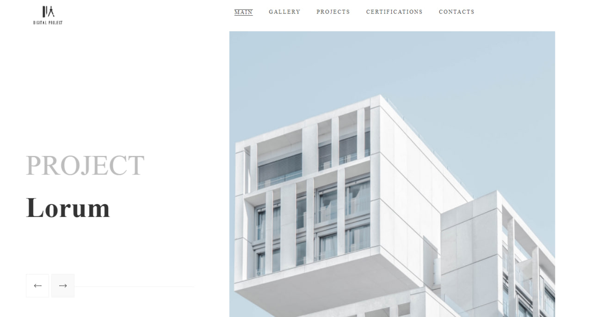

# Practice-March-2023

---

---

##Фунционал сайта

- На данной платформе пользователь имеет возможность ознакомиться с архитектурными проектами.
- Перемещение между страницами сайта, что даёт возможность узнать подробнее об интересующих проектах.
- Карта с местоположением компании.
- Возможность заполнения формы для консультации по архитектурному проекту.

---

##Использованные технологии

---

##Ссылка на сайт

[Сайт архитектурной компании]()

##Разработчики сайта

